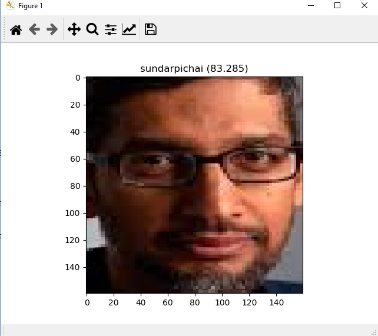

# Face Recognition System
 - Used MTCNN for face detection
 - FaceNet Model is used to create a face embedding for each detected face.
 - Developed a Linear Support Vector Machine for face classification

# Pre-processing
 - Face detection using MTCNN
 - Detect face using and store it as dataset.npz
 - Create face-embedding using Facenet_Keras model for all the images from dataset.npz and store it in embeddings.npz

# Running 
 - Add your photos(>10) in a folder with your name and store it in dataset/train and dataset/val(Use different pictures , since this is used for testing)
 - Run facedetect.py and faceemebed.py to create face-embeddings and run classify to get the result.

# Output

# Accuracy
- Next, the model is evaluated on the train and test dataset, showing perfect classification accuracy. This is not surprising given the size of the dataset and the power of the face detection and face recognition models used.
- Dataset: train=103, test=29
Accuracy: train=100.000, test=100.000

# Loss function
-A convolutional neural network architecture is proposed. For a loss function, FaceNet uses “triplet loss”. Triplet loss relies on minimizing the distance from positive examples, while maximizing the distance from negative examples.

# Adam Optimizer
Adam optimizer is one of the most popular gradient descent optimization algorithms
Adam algorithm first updates the exponential moving averages of the gradient(mt) and the squared gradient(vt) which is the estimates of the first and second moment.
